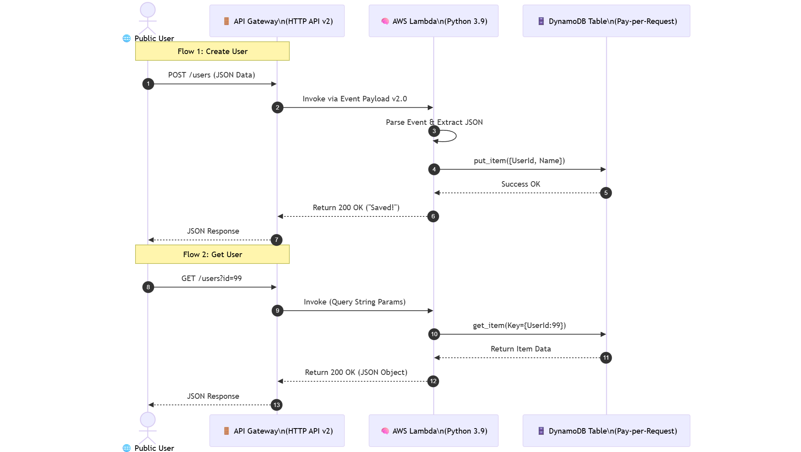

# Serverless REST API (Terraform + Python)

## 📖 Project Overview

This project provisions a completely **Serverless Architecture** for a user management API. Unlike traditional EC2-based applications, this stack incurs **zero cost** when idle.

It demonstrates the "Pay-per-Request" model, utilizing AWS Lambda for compute, API Gateway for routing, and DynamoDB for NoSQL storage.



## 🏗 Architecture

* **API Gateway (HTTP API v2):** The entry point. It accepts HTTP requests and routes them to the Lambda function.
* **AWS Lambda (Python 3.9):** The compute layer. It executes logic only when triggered.
* *Logic:* Handles `GET` (Fetch User) and `POST` (Create User) events.


* **Amazon DynamoDB:** The storage layer. A serverless Key-Value store configured with "On-Demand" capacity (Pay-per-request).
* **IAM Roles:** Strictly scoped permissions allowing the Lambda function to access *only* the specific DynamoDB table and CloudWatch Logs.

## ⚙️ Technical Highlights

* **Infrastructure as Code:** The entire stack (database, permissions, api, code zipping) is managed via Terraform.
* **Archive Provider:** Terraform automatically zips the local `lambda.py` file into `lambda_function.zip` before deployment.
* **Least Privilege:** The IAM policy grants strictly `dynamodb:PutItem` and `dynamodb:GetItem` on the specific table resource, following security best practices.
* **Payload v2.0:** Configured API Gateway to use the modern payload format for simplified JSON parsing in Python.

## 💻 Usage

### 1. Deploy

```bash
terraform init
terraform apply

```

### 2. Test (Curl)

**Create a User:**

```bash
curl -X POST "YOUR_API_URL/users" \
     -H "Content-Type: application/json" \
     -d '{"user_id": "01", "name": "Joy"}'

```

**Get a User:**

```bash
curl "YOUR_API_URL/users?id=01"

```

## 🧠 Key Concepts Learned

* **Serverless Computing:** decoupling logic from servers.
* **Event-Driven Architecture:** Handling JSON events from API Gateway.
* **IAM Policy Attachment:** Connecting services securely without access keys.
